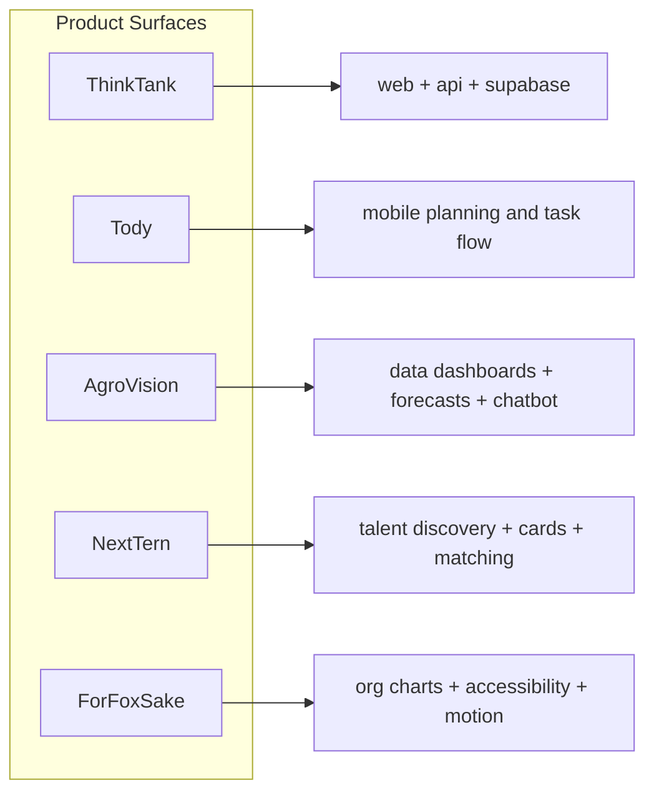

  

   

  
  

---

<table>
<tr>
<td width="60%" valign="top">

## Field Notes

I am Reyyan, a 2nd-year CS student, and the pattern across my work is pretty clear: I keep building systems that sit between raw data and actual decisions.

I like products that feel like control software. Dense when they need to be dense, calm when the user is overloaded, and sharp enough that the interface does not get in the way of the work.

The main thread across my repos is human-centered infrastructure: task flow, market data, talent discovery, org charts, dashboards, and tooling that gives people a cleaner way to think.

</td>
<td width="40%" valign="top">

## Status Panel

| Signal | Readout |
| --- | --- |
| Build bias | product logic first |
| UI shape | monitor-like, structured, high signal |
| Favorite patterns | charts, cards, flows, and systems |
| UX rules | fewer dead ends, better empty states |
| Current lane | full-stack, mobile, data-heavy UI |
| Open for | serious collaborations and useful weirdness |

</td>
</tr>
</table>

---

## What The Repos Say

| Repo | What It Actually Shows | Signal |
| --- | --- | --- |
| [ThinkTank](https://github.com/reyyanxjanbaz/ThinkTank) | Monorepo with React + Vite web, Fastify API, and Supabase. | Full-stack product work with real structure. |
| [Tody](https://github.com/reyyanxjanbaz/Tody) | Gesture-driven task manager built around calm, human-centric planning. | I care about making everyday interactions feel better. |
| [AgroVision](https://github.com/reyyanxjanbaz/AgroVision) | Agricultural dashboard with prices, trends, forecasts, chatbot, and news. | Data visualization, decision support, and dashboard thinking. |
| [NextTern](https://github.com/reyyanxjanbaz/NextTern) | Card-based talent discovery platform for students and recruiters. | Product design with systems thinking and matching logic. |
| [ForFoxSake](https://github.com/reyyanxjanbaz/ForFoxSake-Happyfox-assignment) | Accessible org chart app with React Flow, motion, and keyboard-first UX. | Graph UI, accessibility, and polished interaction design. |

---

## System Map

---

## Operating Principles

- If the screen is busy, the UI should get quieter.
- If the user is confused, the interface should say so sooner.
- If a chart can answer the question faster, use the chart.
- If the interaction needs explanation, the interaction is probably wrong.
- If a project has no edge, I probably will not finish caring about it.

---

## Telemetry

 

---

## Build Preferences

| Area | What I Lean Toward |
| --- | --- |
| Frontend | React, Next.js, Vite, motion, strong state handling |
| Mobile | React Native, gesture-based flows, calmer task UX |
| Backend | Node, Express, Fastify, APIs that stay out of the way |
| Data | Supabase, PostgreSQL, real-time surfaces, useful charts |
| AI | Practical assistants, not decorative AI buttons |
| Web3 | Still interesting when the user story is actually there |

---

## Current Direction

I am most interested in projects that have a visible finish line and enough complexity to justify good design. The kind of stuff I enjoy is usually one of these:

1. A dashboard that helps someone make a real decision faster.
2. A mobile flow that cuts friction instead of adding another screen.
3. A platform with enough moving parts to reward clean structure.
4. A graph-heavy interface that still feels easy to use.
5. A product where the details matter and the polish is obvious.

---

Building in public, but trying to keep the output human.

