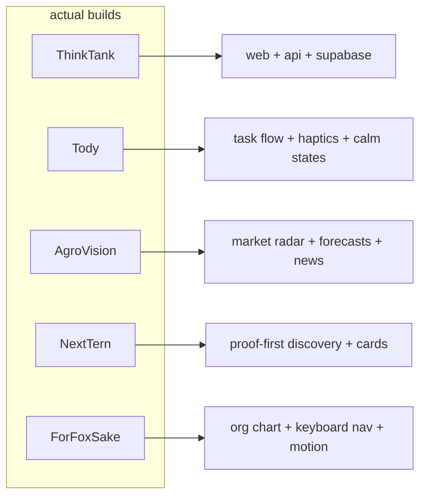
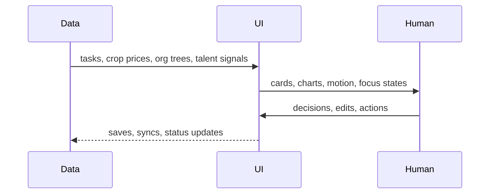

<div align="center">

  

  <p><strong>i build software that feels like a control panel with a pulse.</strong></p>
  <p>2nd-year cs student. i keep ending up in products where charts, cards, state, and clarity matter more than decoration.</p>

</div>

---

<table>
<tr>
<td width="58%" valign="top">

<h2>live readout</h2>

i’m reyyan. the pattern across my work is pretty obvious: i build systems that turn messy information into something a person can actually use.

i like interfaces that feel a bit dense, a bit sharp, and still calm enough to trust. if a chart answers the question faster, i want the chart. if a screen is getting loud, i’d rather quiet it down than pile on more noise.

my best work usually sits somewhere between product logic and visual systems. not just “make it pretty,” more like “make the whole thing make sense.”

</td>
<td width="42%" valign="top">

<h2>telemetry</h2>

| signal | level |
| --- | --- |
| product logic | ██████████ |
| charts / dashboards | ██████████ |
| human-first UX | █████████░ |
| motion / interaction | ████████░░ |
| backend structure | █████████░ |
| ai fluff tolerance | ░░░░░░░░░░ |

</td>
</tr>
</table>

---

## what the repos say

| repo | what it tells me | mode |
| --- | --- | --- |
| [ThinkTank](https://github.com/reyyanxjanbaz/ThinkTank) | monorepo energy: React + Vite web, Fastify api, Supabase, deployable structure | product systems |
| [Tody](https://github.com/reyyanxjanbaz/Tody) | a task manager built around calm computing, haptics, pull-to-focus, and lower-friction planning | calm UX |
| [AgroVision](https://github.com/reyyanxjanbaz/AgroVision) | crop prices, trend charts, forecasts, weather pressure, chatbot, news | dashboard / charts |
| [NextTern](https://github.com/reyyanxjanbaz/NextTern) | human-first talent discovery, proof over claims, cards instead of paperwork | matching systems |
| [ForFoxSake](https://github.com/reyyanxjanbaz/ForFoxSake-Happyfox-assignment) | org chart visualization, keyboard-first flow, motion, accessibility, React Flow | graph ui |

---

## system map





---

## how i think

- if it feels like paperwork, i redesign it.
- if the state is important, the ui should show it.
- if the user is overloaded, the interface should stop shouting.
- if a chart makes the pattern obvious, use the chart.
- if the design needs a tutorial to survive, it needs a rethink.

---

## stack bias

| area | what i keep reaching for |
| --- | --- |
| frontend | React, Next.js, Vite, TypeScript, motion, responsive systems |
| mobile | React Native, gestures, haptics, calmer task flows |
| backend | Node, Fastify, Express, Supabase, PostgreSQL |
| data | dashboards, timelines, trends, forecasts, decision surfaces |
| ai | useful only when it removes friction |
| visual style | dark control rooms, cards, graphs, status panels |

---

## signal bars

```txt
clarity              ██████████  high
charts               ██████████  very high
humanness            █████████░  important
motion               ████████░░  used when it helps
decorative ai        ░░░░░░░░░░  basically off
```

---

## telemetry

<div align="center">


<br />


</div>

---

## what i want more of

1. dashboards that help someone decide faster.
2. mobile flows that cut friction instead of adding it.
3. graph-heavy interfaces that stay readable under pressure.
4. products with enough depth to justify serious structure.
5. the kind of work where polish is obvious and not performative.

---

<div align="center">

<sub>if you want the short version: i care about clarity, control, and screens that feel alive without being fake.</sub>

</div>
